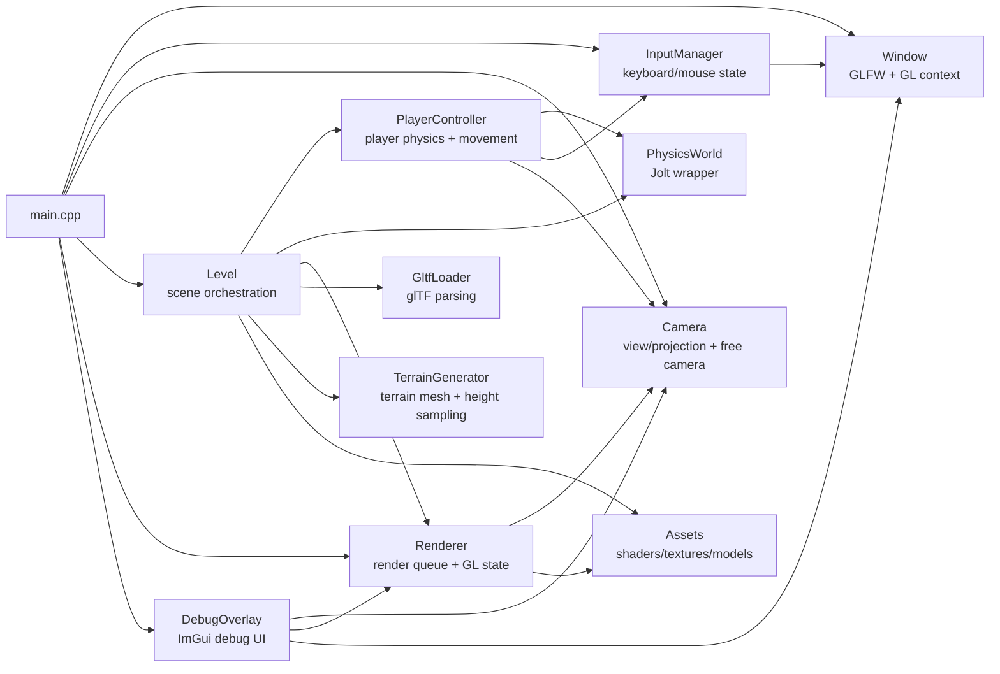
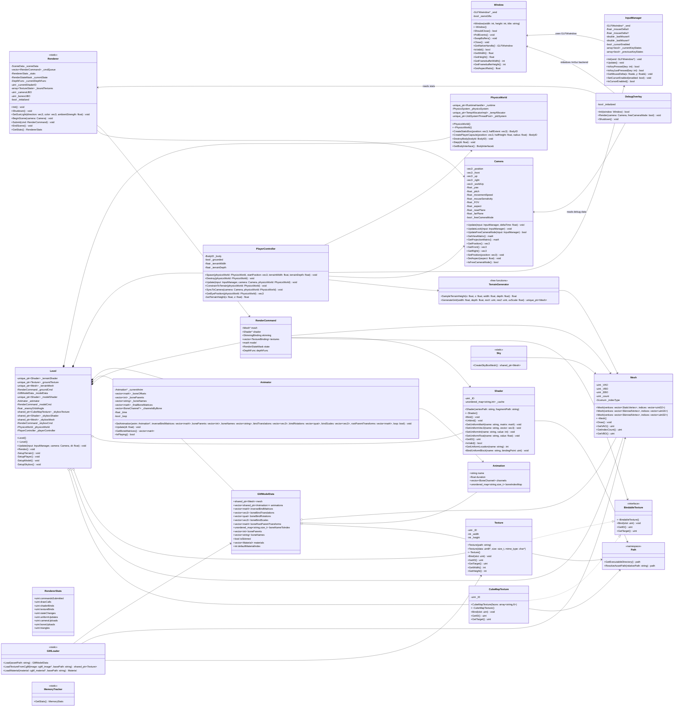
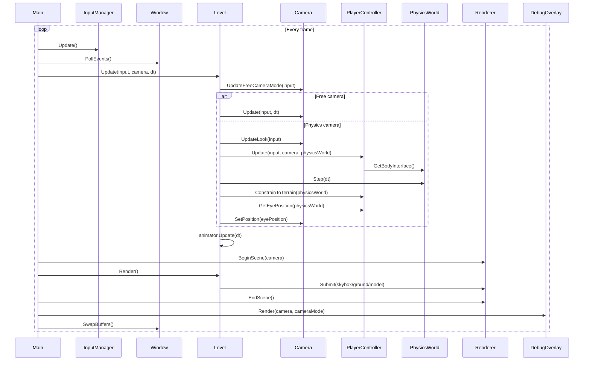

# Project UML

## High-Level Architecture

```mermaid
flowchart LR
  Main["main.cpp"]
  Window["Window\nGLFW + GL context"]
  Input["InputManager\nkeyboard/mouse state"]
  Camera["Camera\nview/projection + free camera"]
  Level["Level\nscene orchestration"]
  Player["PlayerController\nplayer physics + movement"]
  Physics["PhysicsWorld\nJolt wrapper"]
  Renderer["Renderer\nrender queue + GL state"]
  Overlay["DebugOverlay\nImGui debug UI"]
  Assets["Assets\nshaders/textures/models"]
  Gltf["GltfLoader\nglTF parsing"]
  Terrain["TerrainGenerator\nterrain mesh + height sampling"]

  Main --> Window
  Main --> Input
  Main --> Camera
  Main --> Level
  Main --> Renderer
  Main --> Overlay

  Input --> Window
  Level --> Player
  Level --> Physics
  Level --> Renderer
  Level --> Gltf
  Level --> Terrain
  Level --> Assets
  Player --> Physics
  Player --> Input
  Player --> Camera
  Renderer --> Camera
  Renderer --> Assets
  Overlay --> Camera
  Overlay --> Renderer
  Overlay --> Window
```

## Detailed Class Diagram

```mermaid
classDiagram
  direction LR

  class Window {
    -GLFWwindow* _wnd
    -bool _ownsGlfw
    +Window(width: int, height: int, title: string)
    +~Window()
    +ShouldClose() bool
    +PollEvents() void
    +SwapBuffers() void
    +Close() void
    +GetNativeHandle() GLFWwindow*
    +IsValid() bool
    +GetWidth() float
    +GetHeight() float
    +GetFramebufferWidth() int
    +GetFramebufferHeight() int
    +GetAspectRatio() float
  }

  class InputManager {
    -GLFWwindow* _wnd
    -float _mouseDeltaX
    -float _mouseDeltaY
    -double _lastMouseX
    -double _lastMouseY
    -bool _cursorEnabled
    -array~bool~ _currentKeyStates
    -array~bool~ _previousKeyStates
    +Init(wnd: GLFWwindow*) void
    +Update() void
    +IsKeyPressed(key: int) bool
    +IsKeyJustPressed(key: int) bool
    +GetMouseDelta(x: float&, y: float&) void
    +SetCursorEnabled(enabled: bool) void
    +IsCursorEnabled() bool
  }

  class Camera {
    -vec3 _position
    -vec3 _front
    -vec3 _up
    -vec3 _right
    -vec3 _worldUp
    -float _yaw
    -float _pitch
    -float _movementSpeed
    -float _mouseSensitivity
    -float _FOV
    -float _aspect
    -float _nearPlane
    -float _farPlane
    -bool _freeCameraMode
    +Update(input: InputManager, deltaTime: float) void
    +UpdateLook(input: InputManager) void
    +UpdateFreeCameraMode(input: InputManager) bool
    +GetViewMatrix() mat4
    +GetProjectionMatrix() mat4
    +GetPosition() vec3
    +GetFront() vec3
    +GetRight() vec3
    +SetPosition(position: vec3) void
    +SetAspect(aspect: float) void
    +IsFreeCameraMode() bool
  }

  class DebugOverlay {
    -bool _initialized
    +Init(window: Window) bool
    +Render(camera: Camera, freeCameraMode: bool) void
    +Shutdown() void
  }

  class Level {
    -unique_ptr~Shader~ _terrainShader
    -unique_ptr~Texture~ _groundTexture
    -unique_ptr~Mesh~ _terrainMesh
    -RenderCommand _groundCmd
    -GltfModelData _modelData
    -unique_ptr~Shader~ _modelShader
    -Animator _animator
    -RenderCommand _modelCmd
    -float _enemyOrbitAngle
    -shared_ptr~CubeMapTexture~ _skyboxTexture
    -shared_ptr~Shader~ _skyboxShader
    -shared_ptr~Mesh~ _skyboxMesh
    -RenderCommand _skyboxCmd
    -PhysicsWorld _physicsWorld
    -PlayerController _playerController
    +Level()
    +~Level()
    +Update(input: InputManager, camera: Camera, dt: float) void
    +Render() void
    -SetupTerrain() void
    -SetupPlayer() void
    -SetupModel() void
    -SetupSkybox() void
  }

  class PlayerController {
    -BodyID _body
    -bool _grounded
    -float _terrainWidth
    -float _terrainDepth
    +Spawn(physicsWorld: PhysicsWorld, startPosition: vec3, terrainWidth: float, terrainDepth: float) void
    +Destroy(physicsWorld: PhysicsWorld) void
    +Update(input: InputManager, camera: Camera, physicsWorld: PhysicsWorld) void
    +ConstrainToTerrain(physicsWorld: PhysicsWorld) void
    +SyncToCamera(camera: Camera, physicsWorld: PhysicsWorld) void
    +GetEyePosition(physicsWorld: PhysicsWorld) vec3
    -GetTerrainHeight(x: float, z: float) float
  }

  class PhysicsWorld {
    -unique_ptr~RuntimeHandle~ _runtime
    -PhysicsSystem _physicsSystem
    -unique_ptr~TempAllocatorImpl~ _tempAllocator
    -unique_ptr~JobSystemThreadPool~ _jobSystem
    +PhysicsWorld()
    +~PhysicsWorld()
    +CreateStaticBox(position: vec3, halfExtent: vec3) BodyID
    +CreatePlayerCapsule(position: vec3, halfHeight: float, radius: float) BodyID
    +DestroyBody(bodyId: BodyID) void
    +Step(dt: float) void
    +GetBodyInterface() BodyInterface&
  }

  class Renderer {
    <<static>>
    -SceneData _sceneData
    -vector~RenderCommand~ _cmdQueue
    -RendererStats _stats
    -RenderStateMask _currentState
    -DepthFunc _currentDepthFunc
    -uint _currentShaderID
    -array~TextureState~ _boundTextures
    -uint _cameraUBO
    -uint _bonesUBO
    -bool _initialized
    +Init() void
    +Shutdown() void
    +SetSunLight(direction: vec3, color: vec3, ambientStrength: float) void
    +BeginScene(camera: Camera) void
    +Submit(cmd: RenderCommand) void
    +EndScene() void
    +GetStats() RendererStats
  }

  class RenderCommand {
    +Mesh* mesh
    +Shader* shader
    +SkinningBinding skinning
    +vector~TextureBinding~ textures
    +mat4 model
    +RenderStateMask state
    +DepthFunc depthFunc
  }

  class RendererStats {
    +uint commandsSubmitted
    +uint drawCalls
    +uint shaderBinds
    +uint textureBinds
    +uint stateChanges
    +uint uniformUpdates
    +uint cameraUploads
    +uint boneUploads
    +uint triangles
  }

  class Mesh {
    -uint _VAO
    -uint _VBO
    -uint _EBO
    -uint _count
    -GLenum _indexType
    +Mesh(vertices: vector~StaticVertex~, indices: vector~uint32~)
    +Mesh(vertices: vector~SkinnedVertex~, indices: vector~uint16~)
    +Mesh(vertices: vector~SkinnedVertex~, indices: vector~uint32~)
    +~Mesh()
    +Draw() void
    +GetVAO() uint
    +GetIndexCount() uint
    +GetVBO() uint
  }

  class Shader {
    -uint _ID
    -unordered_map~string,int~ _cache
    +Shader(vertexPath: string, fragmentPath: string)
    +~Shader()
    +Bind() void
    +Unbind() void
    +SetUniformMat4(name: string, matrix: mat4) void
    +SetUniformVec3(name: string, vector: vec3) void
    +SetUniformInt(name: string, value: int) void
    +SetUniformFloat(name: string, value: float) void
    +GetID() uint
    +IsValid() bool
    +GetUniformLocation(name: string) int
    +BindUniformBlock(name: string, bindingPoint: uint) void
  }

  class BindableTexture {
    <<interface>>
    +~BindableTexture()
    +Bind(slot: uint) void
    +GetID() uint
    +GetTarget() uint
  }

  class Texture {
    -uint _ID
    -int _width
    -int _height
    +Texture(path: string)
    +Texture(data: uint8*, size: size_t, mime_type: char*)
    +~Texture()
    +Bind(slot: uint) void
    +GetID() uint
    +GetTarget() uint
    +GetWidth() int
    +GetHeight() int
  }

  class CubeMapTexture {
    -uint _ID
    +CubeMapTexture(faces: array~string,6~)
    +~CubeMapTexture()
    +Bind(slot: uint) void
    +GetID() uint
    +GetTarget() uint
  }

  class GltfLoader {
    <<static>>
    +Load(assetPath: string) GltfModelData
    +LoadTextureFromCgltf(image: cgltf_image*, basePath: string) shared_ptr~Texture~
    +LoadMaterial(material: cgltf_material*, basePath: string) Material
  }

  class GltfModelData {
    +shared_ptr~Mesh~ mesh
    +vector~shared_ptr~Animation~~ animations
    +vector~mat4~ inverseBindMatrices
    +vector~vec3~ boneBindTranslations
    +vector~quat~ boneBindRotations
    +vector~vec3~ boneBindScales
    +vector~mat4~ boneRootParentTransforms
    +unordered_map~string,size_t~ boneNameToIndex
    +vector~int~ boneParents
    +vector~string~ boneNames
    +bool isSkinned
    +vector~Material~ materials
    +int defaultMaterialIndex
  }

  class Animation {
    +string name
    +float duration
    +vector~BoneChannel~ channels
    +unordered_map~string,size_t~ boneIndexMap
  }

  class Animator {
    -Animation* _currentAnim
    -vector~mat4~ _boneOffsets
    -vector~int~ _boneParents
    -vector~string~ _boneNames
    -vector~mat4~ _finalBoneMatrices
    -vector~BoneChannel*~ _channelsByBone
    -float _time
    -bool _loop
    +SetAnimation(anim: Animation*, inverseBindMatrices: vector~mat4~, boneParents: vector~int~, boneNames: vector~string~, bindTranslations: vector~vec3~, bindRotations: vector~quat~, bindScales: vector~vec3~, rootParentTransforms: vector~mat4~, loop: bool) void
    +Update(dt: float) void
    +GetBoneMatrices() vector~mat4~
    +IsPlaying() bool
  }

  class TerrainGenerator {
    <<free functions>>
    +SampleTerrainHeight(x: float, z: float, width: float, depth: float) float
    +GenerateGrid(width: float, depth: float, resX: uint, resZ: uint, uvScale: float) unique_ptr~Mesh~
  }

  class Sky {
    <<static>>
    +CreateSkyBoxMesh() shared_ptr~Mesh~
  }

  class MemoryTracker {
    <<static>>
    +GetStats() MemoryStats
  }

  class Path {
    <<namespace>>
    +GetExecutableDirectory() path
    +ResolveAssetPath(relativePath: string) path
  }

  Window <-- InputManager : uses GLFWwindow
  Window <-- DebugOverlay : initializes ImGui backend
  Camera <-- DebugOverlay : reads debug data
  Renderer <-- DebugOverlay : reads stats

  Level *-- PhysicsWorld
  Level *-- PlayerController
  Level *-- Animator
  Level *-- GltfModelData
  Level *-- RenderCommand
  Level o-- Shader
  Level o-- Texture
  Level o-- Mesh
  Level o-- CubeMapTexture

  PlayerController --> PhysicsWorld
  PlayerController --> InputManager
  PlayerController --> Camera
  PlayerController --> TerrainGenerator

  Renderer --> RenderCommand
  Renderer --> Camera
  RenderCommand --> Mesh
  RenderCommand --> Shader
  RenderCommand --> BindableTexture

  Texture ..|> BindableTexture
  CubeMapTexture ..|> BindableTexture

  GltfLoader --> GltfModelData
  GltfLoader --> Mesh
  GltfLoader --> Texture
  GltfModelData o-- Mesh
  GltfModelData o-- Animation
  GltfModelData o-- Texture
  Animator --> Animation

  TerrainGenerator --> Mesh
  Sky --> Mesh
  Shader --> Path
  Texture --> Path
  CubeMapTexture --> Path
```

## Runtime Update Flow

```mermaid
sequenceDiagram
  participant Main
  participant InputManager
  participant Window
  participant Level
  participant Camera
  participant PlayerController
  participant PhysicsWorld
  participant Renderer
  participant DebugOverlay

  loop Every frame
    Main->>InputManager: Update()
    Main->>Window: PollEvents()
    Main->>Level: Update(input, camera, dt)
    Level->>Camera: UpdateFreeCameraMode(input)
    alt Free camera
      Level->>Camera: Update(input, dt)
    else Physics camera
      Level->>Camera: UpdateLook(input)
      Level->>PlayerController: Update(input, camera, physicsWorld)
      PlayerController->>PhysicsWorld: GetBodyInterface()
      Level->>PhysicsWorld: Step(dt)
      Level->>PlayerController: ConstrainToTerrain(physicsWorld)
      Level->>PlayerController: GetEyePosition(physicsWorld)
      Level->>Camera: SetPosition(eyePosition)
    end
    Level->>Level: animator.Update(dt)
    Main->>Renderer: BeginScene(camera)
    Main->>Level: Render()
    Level->>Renderer: Submit(skybox/ground/model)
    Main->>Renderer: EndScene()
    Main->>DebugOverlay: Render(camera, cameraMode)
    Main->>Window: SwapBuffers()
  end
```
